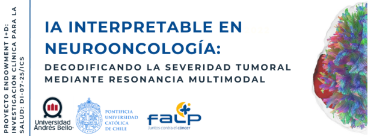

# Workshop: IA Interpretable en Neurooncología: Decodificando la severidad tumoral mediante resonancia multimodal

---

<p align="center">
  <a href="https://www.ismrm.org/meetings-workshops/endorsement-request/">
    
  </a>
</p>

> **Gran Noticia / Announcement:** ¡Este Workshop cuenta con el **respaldo y endoso oficial de la ISMRT** (International Society for Magnetic Resonance Technicians)! El patrocinio institucional fue discutido y aprobado por el comité ejecutivo durante la reunión anual en Ciudad del Cabo (Cape Town).


---
<p align="center">
  <a href="https://docs.google.com/forms/d/e/1FAIpQLScVTNZGnZ7jFYkFfVNsTKiw_LQcgZfaXG4y_08lIPOTNVzjhA/viewform?usp=sharing" target="_blank" rel="noopener noreferrer">
    
  </a>

  <a href="https://docs.google.com/forms/d/e/1FAIpQLSffyLNNJZKNM4mLKOeudr3ltQmXyKQiwgkqvS51f6Oqe73-_A/viewform?usp=publish-editor" target="_blank" rel="noopener noreferrer">
    
  </a>

  <a href="https://docs.google.com/viewer?url=https://raw.githubusercontent.com/pamelaFranco/workshop_glioma/main/Programa/Charlas___Workshop_IA_Interpretable_Neurooncologia.pdf" target="_blank">
    
  </a>

  <a href="https://www.instagram.com/neuro_artint/" target="_blank" rel="noopener noreferrer">
    
  </a>
</p>

<p align="center">
  <a href="https://docs.google.com/forms/d/e/1FAIpQLScrvB4-sUyraLQAthbE9K0Ph2O1xWT8xWlNHzRo8drDvrYp3Q/viewform?usp=sharing" target="_blank" rel="noopener noreferrer">
    
  </a>
  
  <a href="mailto:neurooncologia.ia@gmail.com">
    
  </a>
</p>

---
## Tabla de Contenidos

* [Información del Evento](#información-del-evento)
* [Expositores y Especialistas](#expositores-y-especialistas)
* [Introducción](#introducción)
* [Cómo usar este Workshop](#cómo-usar-este-workshop)
* [Actividades del Workshop](#actividades-del-workshop)
* [Envío de Resúmenes](#envío-de-resúmenes-abstracts)
* [Estructura del Repositorio](#estructura-del-repositorio)
* [Requisitos Técnicos](#requisitos-técnicos-uso-local)
* [Publicaciones Asociadas](#publicaciones-asociadas)
* [Preguntas Frecuentes](#preguntas-frecuentes-faq)
* [Alianza e Integración Internacional](#alianza-e-integración-internacional)
* [Reconocimiento Internacional](#reconocimiento-internacional)
* [Agradecimientos](#agradecimientos)
* [Contacto, Soporte e Internacionalización](#contacto-soporte-e-internacionalización)

---
##  Información del Evento

| Fecha | Horario | Lugar / Modalidad |
| :---: | :---: | :--- |
| 10 de diciembre de 2026 | 8:00 AM - 17:00 PM (GMT-4 / Hora de Chile)| **Presencial:** Auditorio Zócalo, Universidad Andrés Bello <br> (Antonio Varas 880, Providencia, Santiago, Chile) <br><br> **Online:** Vía Zoom (Enlace enviado tras inscripción) |

---
## Expositores y Especialistas
Contamos con un equipo multidisciplinario de expertos en física, ingeniería y oncología:

| Ponente | Institución | Especialidad | Información |
| :--- | :--- | :--- | :--- |
| **Especialista Clínico** | FALP |Neurooncología Clínica | [](https://orcid.org/0000-0000-0000-0000)|
| **TM. Alejandro Cerda** | UNAB - ISMRT |Protocolos Clínicos en Gliomas |[](https://cl.linkedin.com/in/alejandro-cerda-escobar-53b13ba3)|
| **Dr. Ignacio Espinoza** | UC |Física de la RM |[](https://orcid.org/0000-0003-2400-4498)|
| **Dr. Hernán Mella** | PUCV | Artefactos en RM |[](https://orcid.org/0000-0001-8712-146X)|
| **MSc. Cristian Montalba** | UC - iHEALTH | Difusión y Tractografía|[](https://orcid.org/0000-0003-3370-0233)|
| **Dra. M. Daniela Cornejo** | UC |Mapeo Funcional fMRI |[](https://orcid.org/0009-0003-0425-5721)|
| **Dr. David Ortiz-Puerta** | UV - iHEALTH | PINNs y Modelado BOLD|[](https://orcid.org/0000-0001-6285-3066)|
| **Dr. Antonio Eblen-Zajjur** | UA | Neurovascular y fNIRS|[](https://orcid.org/0000-0002-0077-0318)|
| **Dr. Julio Sotelo** | USM - iHEALTH | Hemodinámica y FEM|[](https://orcid.org/0000-0002-0915-5215)|
| **Dr. Domingo Mery** | UC - iHEALTH - CENIA | Machine Learning|[](https://orcid.org/0000-0003-4748-3882)|
| **Dra. Paola Caprile** | UC - iHEALTH | Radiómica|[](https://orcid.org/0000-0001-7060-262X)|
| **Dra. Pamela Franco** | UNAB |IA e Interpretabilidad|[](https://orcid.org/0000-0001-7629-3653)|
| **Dr. Diego Mellado** | UNAB - ITISB | Interpretabilidad Visual|[](https://orcid.org/0000-0001-8078-253X)|
| **Dra. Liliana Jorquera** | UNAB - EMBS | IEEE EMBS Chile | [](https://orcid.org/0000-0002-6530-2080) |

---
## Introducción
Este repositorio contiene los materiales para el laboratorio virtual sobre neurooncología de precisión. El workshop integra nueve fases críticas del análisis de imágenes médicas:

1. **Fundamentos del Espacio K:** Exploración del dominio de la frecuencia en RM.
2. **Simulación de Secuencias:** Modelado interactivo de las ecuaciones de Bloch para entender el contraste ($TR$, $TE$, $\alpha$).
3. **Física de Resonancia:** Generación de mapas paramétricos ($T1$ y $T2$).
4. **Microestructura Tisular:** Procesamiento de Tensores de Difusión ($DTI$).
5. **Mapeo Funcional:** Exploración de la dinámica de la señal $BOLD$ y $fMRI$.
6. **Hemodinámica y Biomecánica:** Reconstrucción de vasculatura mediante $TOF-MRA$.
7. **Extracción de Características de Radiómica:** Extracción de características cuantitativas de grado médico a partir de la distribución de grises en imágenes digitales.
8. **Pipeline Radiómico para la Clasificación de Gliomas (LGG vs. HGG):** Selección de características críticas y clasificación automatizada a partir de métricas extraídas de resonancia magnética en T1, utilizando datos clínicos reales para diferenciar bajo y alto grado.
9. **IA Interpretable:** Decodificación de severidad mediante radiómica y $SHAP$.

---

## Cómo usar este Workshop

### Obtener los materiales
Puedes trabajar con los materiales de este workshop de dos maneras:

* **Opción A (Recomendada):** Clonar el repositorio localmente mediante Git ejecutando en tu terminal:
    ```bash
    git clone [https://github.com/pamelaFranco/workshop_glioma.git](https://github.com/pamelaFranco/workshop_glioma.git)
    ```
* **Opción B:** Descargar el archivo comprimido directamente en formato ZIP haciendo [clic aquí](https://github.com/pamelaFranco/workshop_glioma/archive/refs/heads/main.zip) (o desde el botón verde **"Code" > "Download ZIP"** en la parte superior de esta página de GitHub).

### Ejecución de las actividades
La forma más sencilla de ejecutar el laboratorio es a través de **Google Colab**, ya que no requiere instalación local.

1. **Selecciona el módulo:** Haz clic en el botón **"Open In Colab"** de la actividad deseada.
2. **Configuración de Datos:** Los notebooks cargan automáticamente los archivos desde este repositorio. Ejecuta las celdas en orden correlativo.
3. **Interactividad:** Los laboratorios están diseñados como entornos de exploración dinámica. En cada módulo encontrarás herramientas interactivas para manipular datos médicos en tiempo real:

    * **Manipulación del Espacio K:** Utiliza *sliders* para filtrar frecuencias en el dominio de Fourier. Observa instantáneamente cómo la eliminación de información afecta la reconstrucción de la imagen.
    * **Simulación de Magnetización (Ecuaciones de Bloch):** Ajusta parámetros de adquisición ($TR$, $TE$, $\alpha$) y constantes de tejido ($T1$, $T2$) para observar las curvas de relajación y entender la física detrás de la generación de contraste en el fantoma.
    * **Exploración de Mapas de Relajación (T1/T2):** Interactúa con los algoritmos de ajuste para visualizar mapas paramétricos que diferencian tejidos sanos de lesiones oncológicas.
    * **Conectividad y Hemodinámica:**
        * **fMRI:** Explora umbrales de activación estadística para identificar redes funcionales cerebrales.
        * **Vasculatura:** Ajusta niveles de segmentación en proyecciones TOF para aislar la red vascular cerebral.
        * **DTI:** Visualiza la anisotropía y la integridad de los tractos de materia blanca afectados por el edema o la infiltración tumoral.
    * **Extracción de Características de Radiómica:** Este módulo actúa como una 'biopsia virtual por software' que extrae la firma digital oculta del glioma, transformando los patrones visuales de la resonancia magnética en mapas de colores y números que miden objetivamente la agresividad, el caos y la heterogeneidad del tumor.
    * **Flujo de Procesamiento y Clasificación Automatizada:** Un pipeline integrado que transforma el caos de los datos radiómicos en un diagnóstico preciso. El sistema normaliza las variables y aplica un filtro de varianza para retener las características críticas; luego, proyecta estas firmas multidimensionales en un mapa visual bidimensional y entrena un clasificador probabilístico para diferenciar LGG de HGG, evaluando rigurosamente su rendimiento mediante métricas de sensibilidad y matrices de confusión clínica.
    * **Simulador Clínico e IA Interpretable (SHAP):** En el módulo de clasificación de gliomas, ajusta variables del paciente (edad, volumen, ubicación) y observa cómo el modelo de IA actualiza sus predicciones y explicaciones visuales.
---

## Actividades del Workshop

### *Hands-on* I.A: Fundamentos del Espacio K y Formación de Imágenes
* **Objetivo:** Comprender la relación entre el Espacio K y la imagen real mediante la Transformada de Fourier.
* **Cuaderno:** [](https://colab.research.google.com/github/pamelaFranco/workshop_glioma/blob/main/Code/EspacioK.ipynb)

### *Hands-on* I.B: Simulador Interactivo de Secuencias (Ecuaciones de Bloch)
* **Objetivo:** Experimentar en tiempo real con los parámetros de adquisición ($TR$, $TE$, $\alpha$) y observar su efecto en la magnetización y el contraste del fantoma.
* **Cuaderno:** [](https://colab.research.google.com/github/pamelaFranco/workshop_glioma/blob/main/Code/simulador_secuencias.ipynb)

### *Hands-on* II: Generación de Mapas Paramétricos ($T1$ y $T2$)
* **Objetivo:** Calcular mapas de tiempos de relajación utilizando modelos de ajuste no lineal.
* **Cuaderno:** [](https://colab.research.google.com/github/pamelaFranco/workshop_glioma/blob/main/Code/T1_T2_maps.ipynb)

### *Hands-on* III: Mapas de Difusión ($DTI$)
* **Objetivo:** Obtener mapas de Fracción de Anisotropía ($FA$), Difusividad Media ($MD$), Difusividad Radial ($RD$) y Difusividad Axial ($AD$) para caracterizar la infiltración tumoral.
* **Cuaderno:** [](https://colab.research.google.com/github/pamelaFranco/workshop_glioma/blob/main/Code/DTI_mapas_difusion.ipynb)

### *Hands-on* IV: Mapeo Funcional ($fMRI$)
* **Objetivo:** Mapear la arquitectura funcional del cerebro mediante el análisis de correlaciones de señales de baja frecuencia en estado de reposo ($rs-fMRI$).
* **Cuaderno:** [](https://colab.research.google.com/github/pamelaFranco/workshop_glioma/blob/main/Code/fMRI.ipynb)

### *Hands-on* V: Hemodinámica y Biomecánica Cerebral ($TOF-MRA$)
* **Objetivo:** Reconstrucción de la vasculatura mediante el uso de imágenes adquiridas en la secuencia Time-Of-Flight ($TOF-MRA$) y la aplicación de la Proyección de Máxima Intensidad ($MIP$).
* **Cuaderno:** [](https://colab.research.google.com/github/pamelaFranco/workshop_glioma/blob/main/Code/Vasculatura_Cerebral.ipynb)

### *Hands-on* VI: Extracción de Características y Mapas de Textura (GLCM) 
* **Objetivo:** Cuantificar la microestructura y heterogeneidad del glioma mediante la extracción de características radiómicas de textura de segundo orden (GLCM) a nivel de vóxel.
* **Cuaderno:** [](https://colab.research.google.com/github/pamelaFranco/workshop_glioma/blob/main/Code/radiomics.ipynb)

### *Hands-on* VII.A: Clasificación y Pipeline Radiómico 
* **Objetivo:** Construir un pipeline de Machine Learning para clasificar el grado tumoral (LGG vs. HGG) a partir de firmas radiómicas.
* **Cuaderno:** [](https://colab.research.google.com/github/pamelaFranco/workshop_glioma/blob/main/Code/ML.ipynb)

### *Hands-on* VII.B: Predicción de Severidad con IA 
* **Objetivo:** Modelar la severidad del tumor mediante Machine Learning interpretable (Caja Blanca).
* **Cuaderno:** [](https://colab.research.google.com/github/pamelaFranco/workshop_glioma/blob/main/Code/Glioma_classification.ipynb)

---

## Envío de Resúmenes ($Abstracts$)

Invitamos a investigadores y especialistas a presentar trabajos relacionados con procesamiento de imágenes médicas, Machine Learning/Deep Learning y aplicaciones en salud.

> **Fecha límite:** 15 de noviembre de 2026, 23:59 PM (UTC-3).

### ¿Cómo obtener la plantilla?
* **Opción A: Formato Word** - [Descargar desde Google Drive](https://docs.google.com/document/d/1190HBUgn2zWm8GyvswGrgzw2nrgt1yDC/edit?usp=drive_link&ouid=100388382858978154255&rtpof=true&sd=true)
* **Opción B: Formato LaTeX** - [Acceder a los archivos en GitHub](https://github.com/pamelaFranco/workshop_glioma/blob/main/Formato%20Abstract/Formato_Resumen___Workshop_IA_Interpretable_Neurooncologia.zip)

---

## Estructura del Repositorio

* **`Code/`**: Notebooks `.ipynb` ($Hands-on$).
* **`Dataset/`**: Datos multimodales (`.mat`, `.nii.gz`, `.dcm` y `.csv`).
* **`Figuras/`**: Recursos visuales y diagramas explicativos.
* **`Formato Abstract/`**: Planillas para escribir el resumen ($abstract$) en formato Word y LaTeX.
* **`Template/`**: Formato editable de la charla (PPTX) e instrucciones del formato póster a presentar el día del evento.
* **`Programa/`**: Cronograma detallado en PDF.
---

## Requisitos Técnicos (Uso Local)
Si prefieres ejecución local, requiere:
* Python 3.10+
* Librerías: `pandas`, `numpy`, `scikit-learn`, `nibabel`, `dipy`, `nilearn`, `shap`, `matplotlib`, `scipy`, `os`, `pyradiomics`.

---

## Publicaciones Asociadas

Este laboratorio virtual implementa los hallazgos descritos en los estudios:

| Publicación | Acceso Directo |
| :--- | :--- |
| **Paper Principal (Magnetic Resonance Materials in Physics, Biology and Medicine (MAGMA) 2026)** | [Leer Artículo](https://link.springer.com/article/10.1007/s10334-026-01346-7) |
| **Conferencia International Conference on Pattern Recognition Systems (ICPRS) 2025** | [Ver en IEEE Xplore](https://ieeexplore.ieee.org/document/11302837) |
| **Abstract European Society of Magnetic Resonance in Medicine and Biology (ESMRMB) 2025** | [Ver en Springer](https://link.springer.com/article/10.1007/s10334-025-01278-8) |

Si utilizas este código o hallazgos para tu investigación, por favor cita los siguientes trabajos:

<details>
<summary><b>Haz clic aquí para ver las citas en formato BibTeX</b></summary>

```bibtex
@article{Franco2026Glioma,
  title={Beyond Binary Classification: A Pilot Study of Imaging-Derived Glioma Severity Modeling Using T1-Weighted and Diffusion MRI Radiomics},
  author={Franco, Pamela and Montalba, Cristian and Caulier-Cisterna, Raúl and Espinoza, Ignacio and Cornejo, M. Daniela and others},
  journal={Magnetic Resonance Materials in Physics, Biology and Medicine (MAGMA)},
  year={2026},
  note={10.1007/s10334-026-01346-7}
}

@inproceedings{Franco2025ICPRS,
  title={Radiomic Glioma Grading Using T1-weighted MRI vs. Diffusion Tensor Metrics: A Proof-of-Concept Comparative Analysis with Explainable Machine Learning},
  author={Franco, Pamela and Montalba, Cristian and Caulier-Cisterna, Raúl and Espinoza, Ignacio and Cornejo, and others},
  booktitle={2025 15th IEEE International Conference on Pattern Recognition Systems (ICPRS)},
  pages={1--7},
  year={2025},
  publisher={IEEE},
  doi={10.1109/ICPRS64124.2025.11302837}
}

@article{Franco2025ESMRMB,
  title={Explainable machine learning models for radiomic-based assessment of glioma severity using multiparametric MRI (Abstract \#215)},
  author={Franco, Pamela and Montalba, Cristian and Caulier-Cisterna, Raúl and Espinoza, Ignacio and Bennet, Carlos and Torres, Francisco and Chabert, Steren and Salas, Rodrigo},
  journal={Magnetic Resonance Materials in Physics, Biology and Medicine},
  volume={38},
  number={1},
  pages={201--202},
  year={2025},
  publisher={Springer},
  doi={10.1007/s10334-025-01278-8}
}

```
</details>


---
## Preguntas Frecuentes (FAQ)

1. **¿El workshop tiene algún costo asociado?** **No, el taller es totalmente gratuito.** Sin embargo, los cupos son limitados; para asegurar tu lugar, es indispensable completar el **formulario de inscripción**.

2. **¿Es necesario instalar software especializado?** No. El workshop está diseñado para ejecutarse en **Google Colab**. Solo necesitas una cuenta de Google y conexión a internet.

3. **¿Qué nivel de conocimientos técnicos se requiere?** El taller es de inmersión técnica. Se recomienda familiaridad básica con Python, aunque los *notebooks* están guiados paso a paso para que perfiles clínicos puedan seguirlos.

4. **¿Habrá premios por la presentación de trabajos?** Sí. El comité científico premiará al **Mejor Póster con $100.000 CLP** en efectivo, además de menciones honrosas.

5. **¿Cómo envío mi resumen?** Debes enviarlo antes del **15 de noviembre de 2026** utilizando los botones de inscripción o envío de *abstracts* al inicio de este README.


---
## Alianza e Integración Internacional

Este workshop se presenta en el marco de **REBECCA-IA**, una iniciativa financiada por el Programa Iberoamericano de Ciencia y Tecnología para el Desarrollo (CYTED) e impulsada por el [Instituto Tecnológico de Medellín (ITM)](https://www.itm.edu.co).

<details>
<summary> <b>¿Qué significa REBECCA-IA? (Haz clic para desplegar)</b></summary>
<br>

* **RE**d
* I**be**roamericana para el
* **C**ontrol Inteligente e Individualizado en el Tratamiento del
* **Cá**ncer con
* **I**nteligencia
* **A**rtificial

</details>

<br>

<p align="left">
  <a href="https://www.itm.edu.co" target="_blank" rel="noopener noreferrer">
    
  </a>
</p>


---
## Reconocimiento Internacional
<table border="0" width="100%">
  <tr>
    <td width="25%" align="center" valign="middle">
      <a href="https://www.ismrm.org/ismrt/" target="_blank" rel="noopener noreferrer">
        
      </a>
    </td>
    <td width="75%" valign="middle">
      Este workshop y su entorno de laboratorios virtuales cuentan con el <strong>respaldo oficial (Endorsement) de la ISMRT</strong> (<em>International Society for Magnetic Resonance Technicians</em>), ratificado por su Junta Ejecutiva durante la reunión anual en Ciudad del Cabo.<br><br>
      Para conocer más sobre la división y sus directrices internacionales, visite el sitio oficial de la <a href="https://www.ismrm.org/ismrt/" target="_blank" rel="noopener noreferrer"><strong>ISMRT International</strong></a>.
    </td>
  </tr>
</table>

---

##  Agradecimientos
Este trabajo fue financiado por el Concurso Endowment I + D en Salud de la Universidad Andrés Bello (UNAB) 2025, proyecto DI-07-25/ICS


---
## Contacto, Soporte e Internacionalización

<table border="0" width="100%">
  <tr>
    <td width="60%" valign="top">
      <h3> Contacto y Soporte Técnico</h3>
      <p>Si tienes dudas académicas, consultas sobre las inscripciones o experimentas problemas técnicos al ejecutar los cuadernos de Google Colab o de forma local, puedes comunicarte a través de los siguientes canales:</p>
      <ul>
        <li><strong>Reportar un problema:</strong> Abre un <a href="https://github.com/pamelaFranco/workshop_glioma/issues" target="_blank" rel="noopener noreferrer">Issue en GitHub</a> detallando el error.</li>
        <li><strong>Consultas Generales:</strong> Escríbenos directamente a <a href="mailto:neurooncologia.ia@gmail.com">neurooncologia.ia@gmail.com</a>.</li>
        <li><strong>Comunidad:</strong> Síguenos y envíanos un mensaje en nuestro Instagram oficial <a href="https://www.instagram.com/neuro_artint/" target="_blank" rel="noopener noreferrer">@neuro_artint</a>.</li>
      </ul>
    </td>
    <td width="40%" valign="top" style="border-left: 1px solid #ccc; padding-left: 20px;">
      <h3> Language / Idioma</h3>
      <p><em>The materials, documentation, and interactive notebooks in this repository are written in <strong>Spanish</strong> to support the local Latin American neuro-oncology and medical physics community.</em></p>
      <p> <strong>Non-Spanish speakers:</strong> You can easily run and translate the Google Colab notebooks using standard browser translation extensions. The underlying Python code and medical imaging libraries (PyRadiomics, NiLearn, DIPY) follow international standards.</p>
    </td>
  </tr>
</table>

--- 
## License

[](https://opensource.org/licenses/MIT)
[](https://www.python.org/downloads/)

